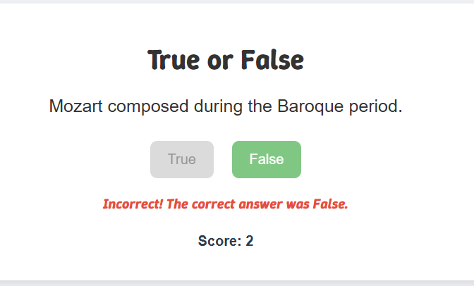
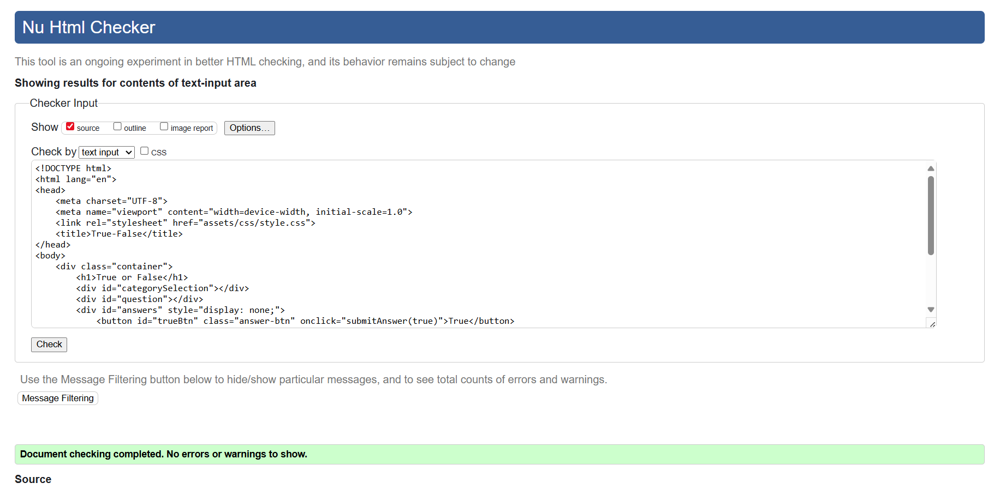
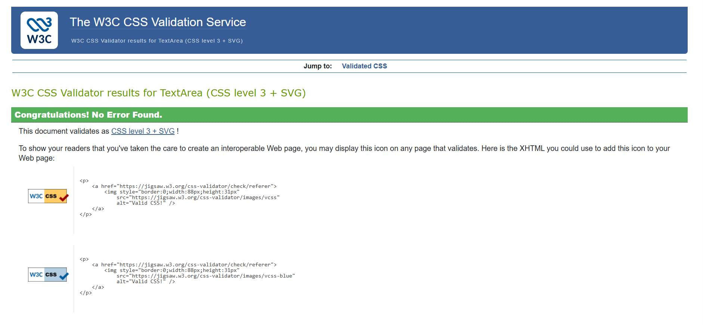
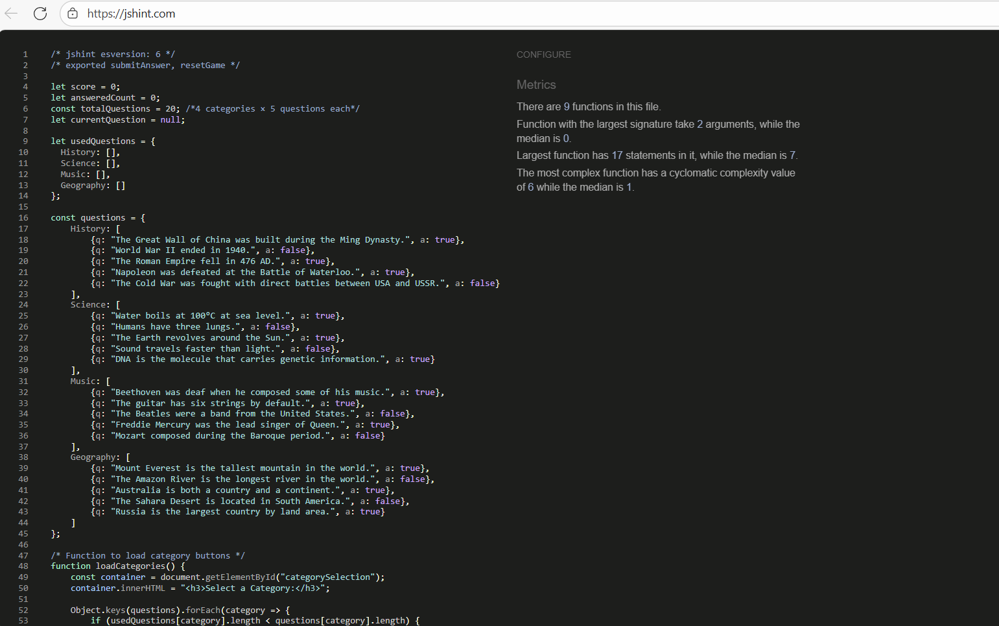
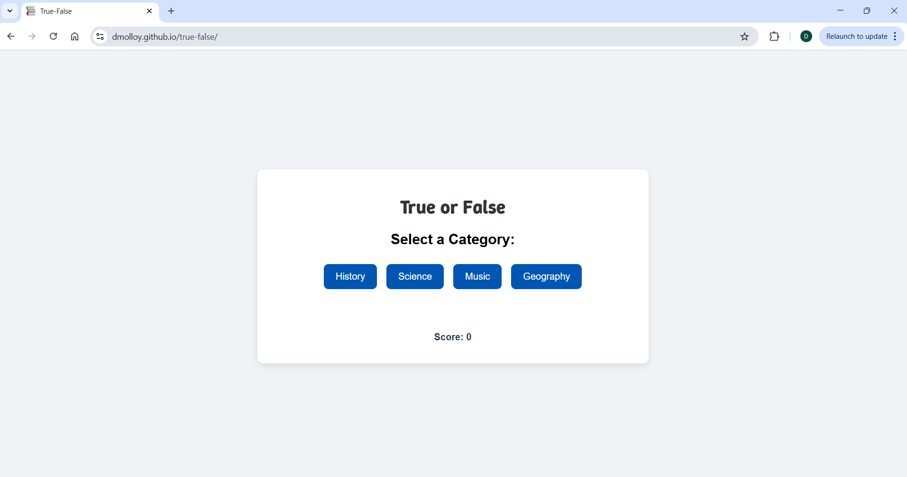
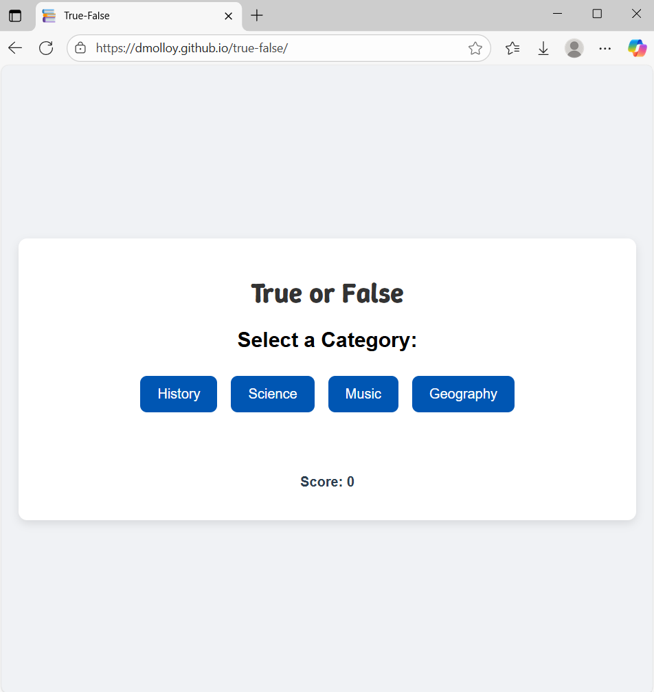
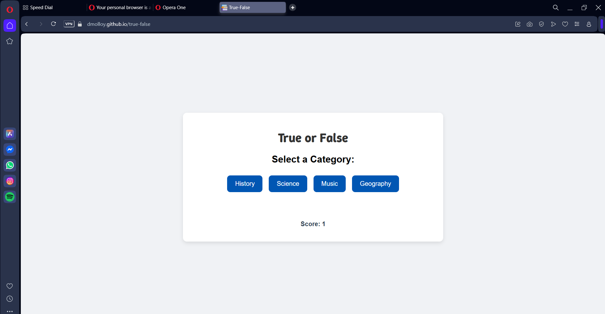
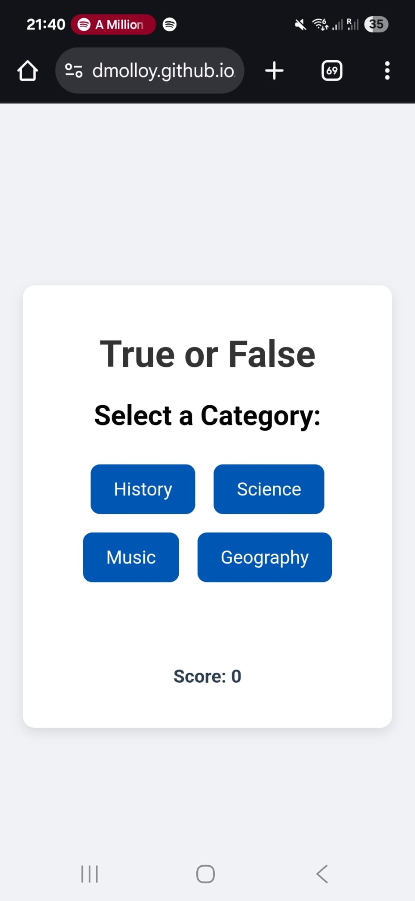
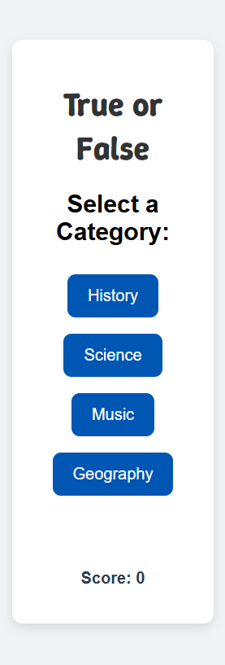
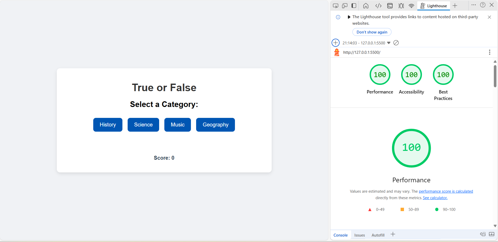

# true-false

## Overview
The aim of this webstite is to make a True-False game for the user to test their knowledge. There will be four categories, with five questions in each. After each question is answered, the user will be able to select the next category to chose from. The questions are given in a random order and no repeat questions. There will be a score tracker to keep a count of how many questions are answered correctly. After the questions have been aswered, a final score will be given and then the game will be refreshed.

This is a solo project built using HTML, CSS, and Javascript. It focuses on a simple but clean looking UI, accessibility, and responsiveness to various screen sizes. 

## User Experience Design
The sight was designed to be clean and minimalistic. The simple design keeps the attention on the quiz itself. High contrast buttons help improve readability and accessibility. 

A feedback message is given after every answer, green for correct, red for incorrect. In the case of an incorrect answer, the correct answer is highlighted in green and the message tells if it was true or false.

The reset button at the end is given a different color to help indicate the end of the game.

## Colour Scheme
The site uses minimal colours. White for the background. A navy colour for the main buttons. Green and red for correct and incorrect messages. And finally red for the reset button a the end of the game, this is to seperate it from the other buttons. 

## Typography
Google Fonts was used for this site. "Winky Sans" for the header and feedback messages to give it a more playful feel. "Arial" for the questions.

## Features
- Four Categories: History, Science, Music, Geography

- Randomised Question: Ensures no repeat within a category

- Score Tracking: Updates once a user answers a question correctly

- Immediate Feedback: Correct/incorrect messages, including the correct answer

- Reset Functionality: Allows users to restart the game once all questions have been answered

## Future Features
- More categories to choose from
- More questions in each category
- Implement a time for each question
- Progress tracker to show how many question in the quiz have been answered
- Store high scores using localStorage

## Tools and Technologies used

### Languages used
- [HTML](https://en.wikipedia.org/wiki/HTML) - Used for the main site content.
- [CSS](https://en.wikipedia.org/wiki/Cascading_Style_Sheets) -Used for styling and colours
- [JavaScript](https://en.wikipedia.org/wiki/JavaScript) - Used to programe the game. 
- [Google Dev Tools](https://developer.chrome.com/docs/devtools) - Used for troubleshooting, testing responsiveness, and styling.
- [GitHub](https://github.com/) - Used to save and store the project files.
- [Gitpod](https://ona.com/) - Used as a cloud-based IDE for development.
- [Git](https://git-scm.com/) - Used for version control. (git add, git commit, git push)
- [Google Fonts](https://fonts.google.com/) - Imported fonts used throughout the website.

## Deployment
The site was deployed to GitHub Pages. The steps to deploy are as follows: 
- In the [GitHub repository](https://github.com/Dmolloy/true-false), navigate to the Settings tab.
- From the source section drop-down menu, select the Main Branch, then click "Save".
- The page will be automatically refreshed with a detailed ribbon display to indicate the successful deployment.

### Local Deployment 
This project can be cloned or forked in order to make a local copy on your own system.

### Cloning
You can clone the repository by following these steps:

1. [Go to the GitHub repository.](https://github.com/Dmolloy/true-false).
2. Locate the Code button above the list of files and click it.
3. Select if you prefer to clone using HTTPS, SSH, or GitHub CLI and click the copy button to copy the URL to your clipboard.
4. Open Git Bash or Terminal.
5. Change the current working directory to the one where you want the cloned directory.
6. In your IDE Terminal, type the following command to clone my repository:
- git clone https://github.com/Dmolloy/true-false.git
6. Press Enter to create your local clone.

### Forking 
By forking the GitHub Repository, we make a copy of the original repository on our GitHub account to view and/or make changes without affecting the original owner's repository. You can fork this repository by using the following steps:

1. Log in to GitHub and locate the [GitHub Repository](https://github.com/Dmolloy/true-false).
2. At the top of the Repository (not top of page) just above the "Settings" Button on the menu, locate the "Fork" Button.
3. Once clicked, you should now have a copy of the original repository in your own GitHub account!

## Testing 
Testing was carried out using the recommended [W3C Markup Validator]() for the HTML and found no issues.

CSS was tested using [W3C CSS Validator]() and found no issues.

JavaScript was tested using [JShint Validator]() and found no errors.

### Browser Compatibility

I tested my deployed project on multiple browsers to check for compatibility issues.

- Chrome - no issues.

- Edge - no issues.

- Safari - no issues.

- Opera - no issues.

### Responsiveness
The site preformed well on smaller screen sizes using Dev Tools.

- Mobile - no issues.

- Small screens - no issues.

### Lighthouse Audit
I tested my deployed project using the Lighthouse Audit tool to check for any issues. The site came back with no issues.

### Bugs
